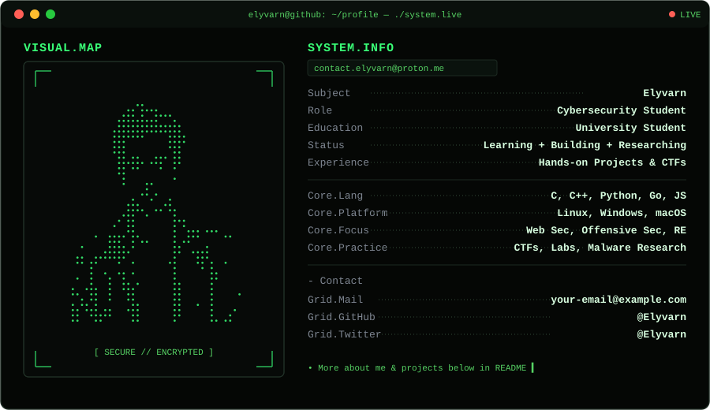

  

  

### DOMAIN

### SPECIALIZATION

### TECH

 

> Build secure software. Understand systems from the inside out. Share knowledge through code and research.
>
> **"The only true wisdom is in knowing you know nothing." — Socrates**

 

## PROJECTS.LIST
`/projects.sh --all`

<table>
<tr>
<td width="50%" valign="top">

**`Elyvarn/project-one`**
> One-line description of a security tool or CTF toolkit you've built.

</td>
<td width="50%" valign="top">

**`Elyvarn/project-two`**
> One-line description of another project — write-ups, exploits, or a CLI tool.

</td>
</tr>
</table>

 

*⁂ more research & write-ups coming soon*

